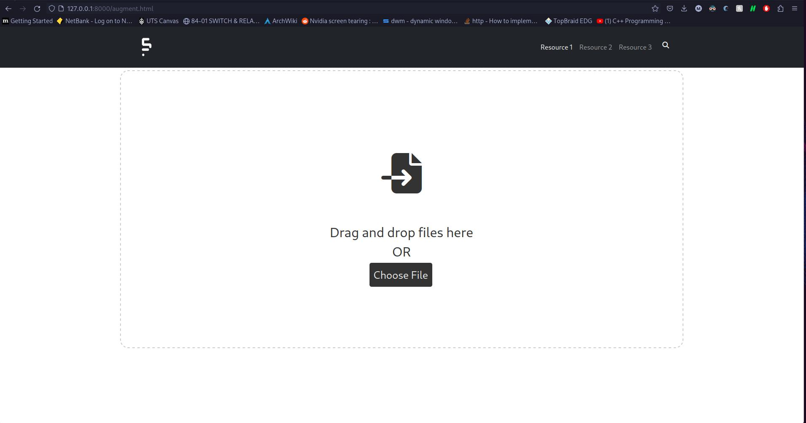
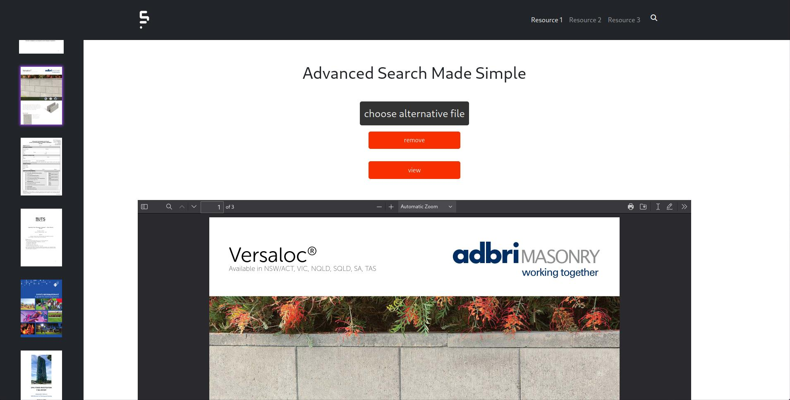
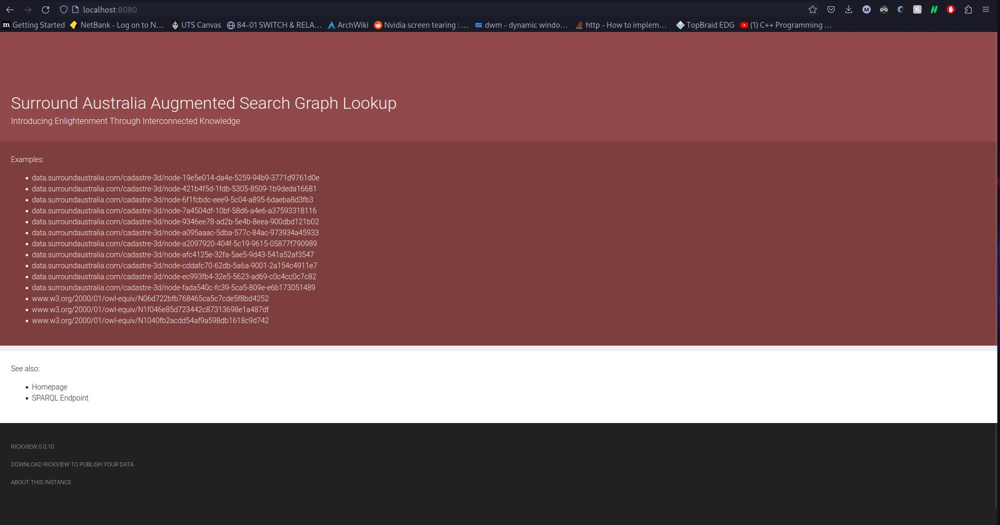
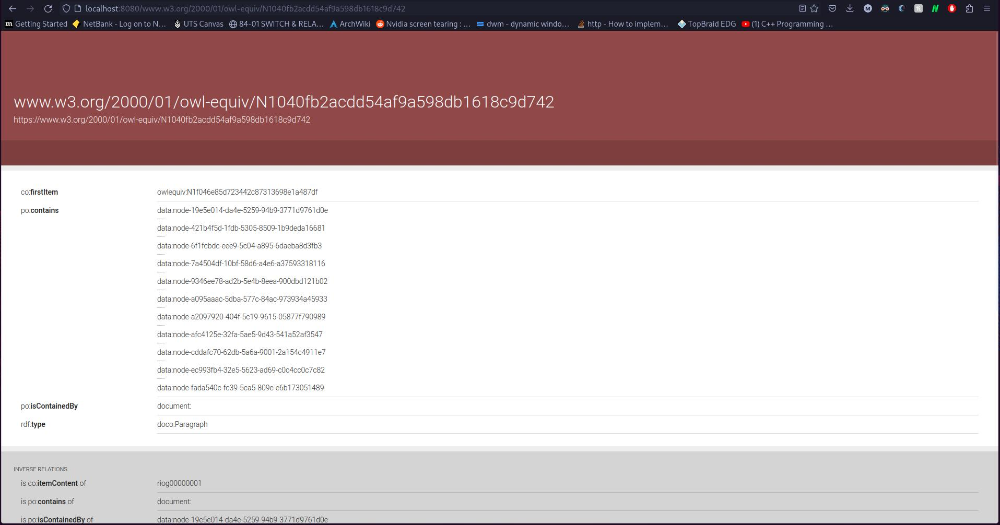
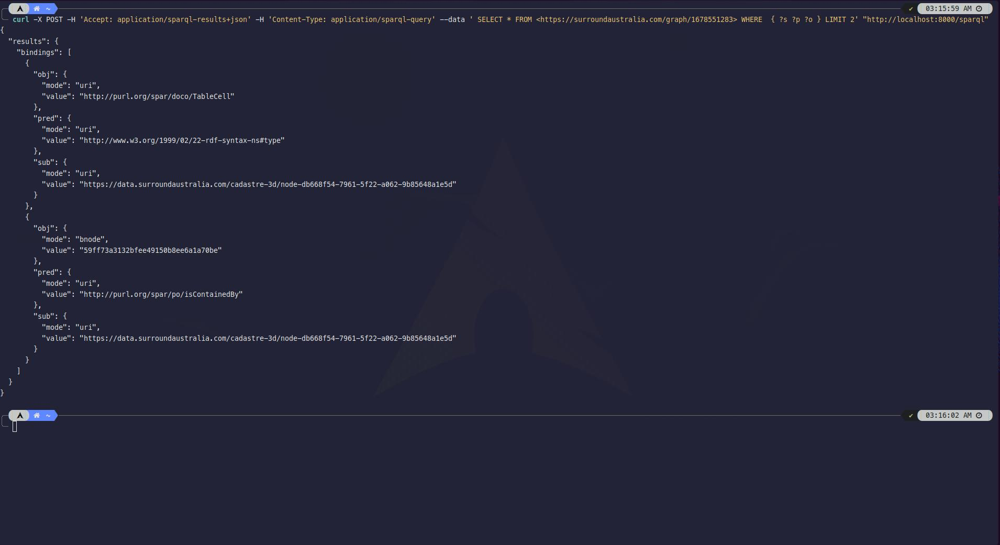
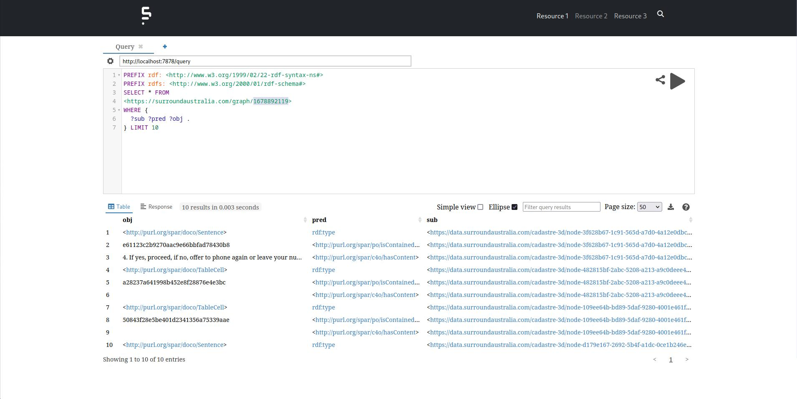
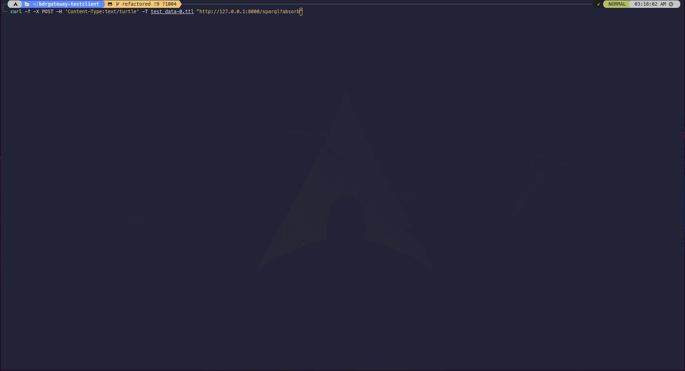

# Readme

This is a web server built with the Actix Web Framework for Rust. It serves HTML files with an included navbar, as well as other types of files such as PDFs and images. It also includes routes for handling file deletion and redirecting to a "permission denied" page.

You can run the server with the command:

`
cargo run --release
`

# Dependancies
This repository is self building, for all but one dependancy, poppler and poppler-glib. However, there is still reliance on C++ headers and gcc/g++/msvc. To install these dependancies on Ubuntu, run the following terminal command:
```
sudo apt-get update

sudo apt-get install -y g++ autoconf libnss3-dev make build-essential \
cmake libcairo2-dev libjpeg-dev libpng-dev libtiff-dev libfontconfig1-dev \
pkg-config libglib2.0-dev libnss3 libgif-dev libblkid-dev e2fslibs-dev \
libboost-all-dev libaudit-dev libpoppler-dev libpoppler-glib8
```
N.B: If you run a non Debian based distribution, you will need to swap `apt` out with your package manager, and also need to change the packages to match the package name of your distribution. For example, if you use Arch Linux, this would be `pacman` and `libpoppler-dev` would instead be called `poppler`.

# Features

| Endpoint | Functionality                                             
|----------|-----------------------------------------------------------
|/submit   | This endpoint transforms PDF documents to RDF via the sematic extractor of documents. The PDF's are mapped to a time since Unix EPOCH, and associated thumbnails are created via [libcairo](https://github.com/lambdaclass/cairo-rs), and stored to /upload/thumbnails/URI.png.
|/sparql   | This endpoint is responsible for sparql: `curl -X POST -H 'Accept: application/sparql-results+json' -H 'Content-Type: application/sparql-query' --data ' SELECT * FROM <https://company-name.com/graph/1678551283> WHERE  { ?s ?p ?o } LIMIT 2' "http://localhost:8000/sparql"`. Where a general query is required for testing, simply remove FROM <graph>.
|/sparql?absorb | This endpoint allows for the absorbtion of files into a graph, and will also allow for persistance accross application startup. An example post request is as follows: `curl -f -X POST -H 'Content-Type:text/turtle' -T test_data-0.ttl "http://127.0.0.1:8000/sparql?absorb"`
|/view | This endpoint is responsible for graph compression via [HDT-CPP](https://github.com/rdfhdt/hdt-cpp) and allows for the structure to be parsed via [RickView](https://github.com/KonradHoeffner/rickview)
|/remove | This endpoint is responsible for removing pdf files from the memory cache as well as the server. Thumbnails, docx files and graphs are all removed for the given URI. This is intended to be used via webform and not via CURL, although that too is possible.

**Note that due to cacheing functionality that has been introduced, changes to client-side HTML, CSS and JS files will only be reflected after restarting the server.**

## PDF server-side absorption 
## PDF preview and thumbnailing 
## PDF conversion to docx => RDF 
## Graph Node Linkage 
## SPARQL Endpoint Querying via CURL 
## SPARQL Endpoint querying via front-end 
## SPARQL Endpoint Absorption 
